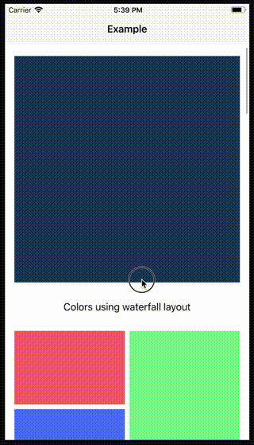

# WaterfallLayout
Waterfall layout in iOS

[](https://github.com/sgr-ksmt/WaterfallLayout/releases)

[](https://github.com/Carthage/Carthage)
[](https://cocoapods.org/pods/WaterfallLayout)
[](https://cocoapods.org/pods/WaterfallLayout)


## Features
- Can select flow/waterfall layout per section.
- Self-Sizing cell available




## How to use

```swift
class ViewController: UIViewController {

    @IBOutlet private weak var collectionView: UICollectionView! {
        didSet {
            let layout = WaterfallLayout()
            layout.delegate = self
            layout.sectionInset = UIEdgeInsets(top: 16, left: 16, bottom: 16, right: 16)
            layout.minimumLineSpacing = 8.0
            layout.minimumInteritemSpacing = 8.0
            layout.headerHeight = 50.0
            collectionView.collectionViewLayout = layout
            collectionView.register(...)
            collectionView.dataSource = self
            collectionView.delegate = self
        }
    }
}

extension ViewController: UICollectionDataSource {
    ...
}

extension ViewController: WaterfallLayoutDelegate {
    func collectionViewLayout(for section: Int) -> WaterfallLayout.Layout {
        switch section {
        case 0: return .flow(column: 1) // single column flow layout
        case 1: return .waterfall(column: 3) // three waterfall layout
        default: return .flow(column: 2)
        }
    }

    func collectionView(_ collectionView: UICollectionView, layout: WaterfallLayout, sizeForItemAt indexPath: IndexPath) -> CGSize {
        return CGSize(...)
    }    
}
```

### Properties
```swift
public var minimumLineSpacing: CGFloat { get set }

public var minimumInteritemSpacing: CGFloat { get set }

public var sectionInset: UIEdgeInsets  { get set }

public var headerHeight: CGFloat  { get set }

public var headerInset: UIEdgeInsets { get set }

public var footerHeight: CGFloat { get set }

public var footerInset: UIEdgeInsets { get set }

public var estimatedItemSize: CGSize { get set }
```

### Layout delegte

```swift
public protocol WaterfallLayoutDelegate: class {
    // MARK: - Required
    func collectionViewLayout(for section: Int) -> WaterfallLayout.Layout
    func collectionView(_ collectionView: UICollectionView, layout: WaterfallLayout, sizeForItemAt indexPath: IndexPath) -> CGSize

    // MARK: - Optional
    func collectionView(_ collectionView: UICollectionView, layout: WaterfallLayout, minimumInteritemSpacingFor section: Int) -> CGFloat?
    func collectionView(_ collectionView: UICollectionView, layout: WaterfallLayout, minimumLineSpacingFor section: Int) -> CGFloat?
    func collectionView(_ collectionView: UICollectionView, layout: WaterfallLayout, sectionInsetFor section: Int) -> UIEdgeInsets?
    func collectionView(_ collectionView: UICollectionView, layout: WaterfallLayout, headerHeightFor section: Int) -> CGFloat?
    func collectionView(_ collectionView: UICollectionView, layout: WaterfallLayout, headerInsetFor section: Int) -> UIEdgeInsets?
    func collectionView(_ collectionView: UICollectionView, layout: WaterfallLayout, footerHeightFor section: Int) -> CGFloat?
    func collectionView(_ collectionView: UICollectionView, layout: WaterfallLayout, footerInsetFor section: Int) -> UIEdgeInsets?
    func collectionView(_ collectionView: UICollectionView, layout: WaterfallLayout, estimatedSizeForItemAt indexPath: IndexPath) -> CGSize?
}
```

## Requirements
- iOS 9.0+
- Xcode 9+
- Swift 4+

## Installation

### Carthage

- Add the following to your *Cartfile*:

```bash
github "sgr-ksmt/WaterfallLayout" ~> 0.1
```

- Run `carthage update`
- Add the framework as described.
<br> Details: [Carthage Readme](https://github.com/Carthage/Carthage#adding-frameworks-to-an-application)


### CocoaPods

**WaterfallLayout** is available through [CocoaPods](http://cocoapods.org). To install
it, simply add the following line to your Podfile:

```ruby
pod 'WaterfallLayout', '~> 0.1'
```

and run `pod install`

### Manually Install
Download all `*.swift` files and put your project.

## Change log
Change log is [here](https://github.com/sgr-ksmt/WaterfallLayout/blob/master/CHANGELOG.md).

## Communication
- If you found a bug, open an issue.
- If you have a feature request, open an issue.
- If you want to contribute, submit a pull request.:muscle:

## License

**WaterfallLayout** is under MIT license. See the [LICENSE](LICENSE) file for more info.
